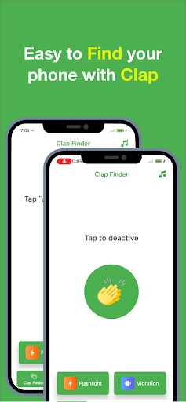
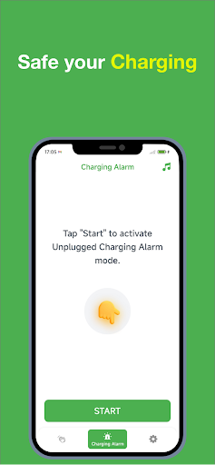
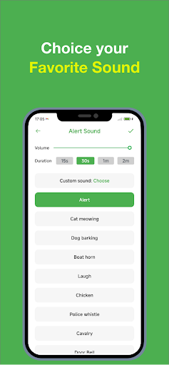
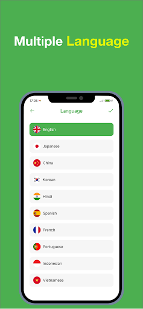

# ClaptoFindmyPhone

[Google Play link](https://play.google.com/store/apps/details?id=com.findmyphone.clapping.find)

## Screenshots

 

## The application use MVVM

- Testable
- UI-independent (the UI can easily be changed without changing the system)
- Independent of databases, frameworks, external agencies, and libraries

## The software architecture scheme

- The UI can only communicate with the ViewModel
- The ViewModel can only communicate with the Repository
 
